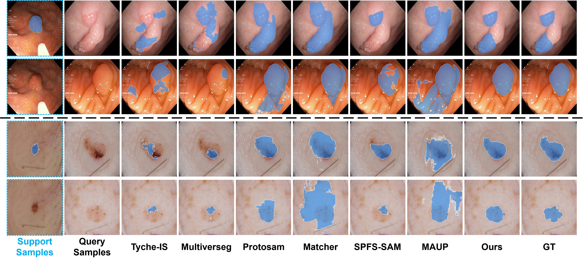
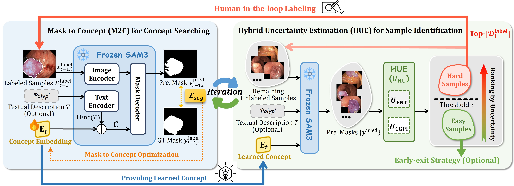

<div align="center">
<h1>M2C: Mask-to-Concept</h1>

Quan Zhou<sup>1&ast;</sup> · Shaoqing Zhai<sup>1&ast;</sup> · [**Qiang Hu**](https://huster-hq.github.io/)<sup>2,&dagger;</sup> · Jia Chen<sup>3</sup> · [**Qiang Li**](http://faculty.hust.edu.cn/liqiang15/zh_CN/index.htm)<sup>2</sup> · [**Zhiwei Wang**](https://andysis.github.io/)<sup>2,&dagger;</sup>
<br>
<sup>1</sup>WuHan University of Technology&emsp; <sup>2</sup>Huazhong University of Science and Technology&emsp;
<br>
<sup>3</sup>Changzhou United Imaging Surgical Co., Ltd.
<br>
&ast;co-first author &emsp; &dagger;corresponding author
</div>

This work presents Mask-to-Concept (M2C), a efficient fine-tuning strategy for SAM3.




*Overview of M2C-based human-in-the-loop annotation system.* 

## 🌟 Features

* Pixel-space diffusion generation (operating directly in image space, without VAE or latent representations), capable of producing flying-pixel-free point clouds from estimated depth maps.
* Our model integrates the discriminative representation (ViT) into generative modeling (DiT), fully leveraging the strengths of both paradigms.
* Our network architecture is purely transformer-based, containing no convolutional layers.
* Although our model is trained at a fixed resolution of 1024×768, it can flexibly support various input resolutions and aspect ratios during inference.

## News
- **2026-03:** code, models, and demo are all released.


## Usage

### Environment Configuration
* Please refer to the official environment configuration of [SAM3](https://github.com/facebookresearch/sam3) to set up your Python environment.
* Download the SAM3 official weights and put them in the `checkpoint/` directory. 


### Dataset Preparation
Download the following datasets and organize them as follows:
* [Kvasir-SEG]()
* [ISIC-2017]()
```bash
datasets/
├── Kvasir-SEG/
├── ISIC-2017/
```

### Few-shot Testing
To perform few-shot evaluation (e.g., 1-shot), split the Kvasir-SEG dataset into a Support Set and a Query Set (Ratio 1:9). Place them in:
* `datasets/Kavsir-seg/support/`
* `datasets/Kavsir-seg/query/`

Step 1: Run the Controller
```bash
python controller.py --pool_root "datasets/Kavsir-seg/support" --n_shot 1 --few_shot
```

Step 2: Run Evaluation
```bash
python test.py --test_pool_root "datasets/Kavsir-seg/query"
```

### Simulated Annotation Process
To simulate the full annotation workflow using the entire dataset (e.g., 5-shot setup), put the full dataset in `datasets/Kavsir-seg/` and run:
```bash
python controller.py --pool_root "datasets/Kavsir-seg" --n_shot 5
```

## Acknowledgement

We are grateful to the [Segment Anything Model 3 (SAM3)](https://github.com/facebookresearch/sam3) team for their code and model release.